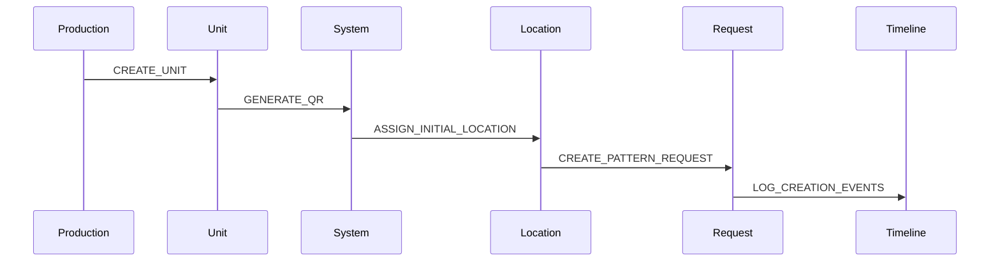
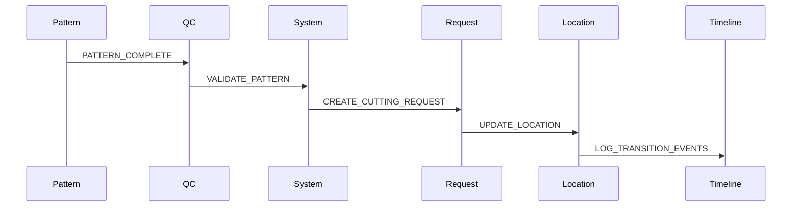

# Event Timeline and Interaction Patterns

## Overview
Events in the system create a continuous timeline that tracks a unit's journey from creation to delivery. Understanding these event interactions and transitions is crucial for maintaining data consistency and process flow.

## Timeline Visualization

### 1. Production Timeline
```
Creation → Pattern → Cutting → QC → Wash → Finishing → Packing → Shipping
   ↑          ↑         ↑      ↑     ↑        ↑          ↑         ↑
   │          │         │      │     │        │          │         │
[CREATE]  [PATTERN]  [CUT]   [QC]  [WASH]  [FINISH]  [PACK]   [SHIP]
   │          │         │      │     │        │          │         │
   ↓          ↓         ↓      ↓     ↓        ↓          ↓         ↓
Location   Pattern    Cutting  QC    Wash   Finishing  Packing  Shipping
Changes    Office     Floor    Area   Bin     Area      Area     Area
```

### 2. Event Cascade Example
```typescript
interface EventCascade {
  trigger_event: {
    type: 'QR_SCAN' | 'STATUS_CHANGE' | 'LOCATION_CHANGE'
    metadata: {
      previous_state: string
      new_state: string
      location?: string
    }
  }
  resulting_events: {
    immediate: Event[]  // Events that must happen immediately
    dependent: Event[]  // Events that depend on other conditions
    scheduled: Event[]  // Events scheduled for future
  }
  state_changes: {
    status?: StatusChange
    location?: LocationChange
    assignments?: AssignmentChange[]
  }
}
```

## Event Interaction Patterns

### 1. Creation to First Location


### 2. Pattern to Cutting Flow


## Critical Event Intersections

### 1. Status and Location Intersections
```typescript
interface StatusLocationIntersection {
  valid_combinations: {
    PRODUCTION: ['PATTERN_OFFICE', 'CUTTING_FLOOR', 'SEWING_AREA']
    STOCK: ['STORAGE_BIN', 'PICKING_AREA']
    WASH: ['WASH_BIN', 'LAUNDRY_TRANSIT']
    QC: ['QC_STATION', 'QC_HOLDING']
  }
  transition_rules: {
    location_change: {
      requires_status_check: boolean
      triggers_status_update: boolean
      validation_rules: ValidationRule[]
    }
    status_change: {
      requires_location_check: boolean
      triggers_location_update: boolean
      validation_rules: ValidationRule[]
    }
  }
}
```

### 2. Request and Status Dependencies
```typescript
interface RequestStatusDependency {
  request_type: RequestType
  required_status: {
    initial: Status
    during: Status[]
    final: Status
  }
  location_requirements: {
    start_location: Location[]
    valid_transitions: Location[]
    end_location: Location[]
  }
  validation_points: {
    entry: ValidationRule[]
    during: ValidationRule[]
    exit: ValidationRule[]
  }
}
```

## Timeline Construction

### 1. Event Aggregation
```typescript
interface TimelineConstruction {
  primary_events: {
    type: EventType
    timestamp: Date
    location: string
    status: string
    actor: string
  }[]
  derived_events: {
    source_event: string
    resulting_events: Event[]
    timing: 'immediate' | 'scheduled' | 'conditional'
  }[]
  timeline_markers: {
    stage_transitions: StageTransition[]
    key_validations: Validation[]
    status_changes: StatusChange[]
    location_changes: LocationChange[]
  }
}
```

### 2. Timeline Queries
```typescript
interface TimelineQuery {
  unit_id: string
  query_type: 'FULL' | 'STATUS' | 'LOCATION' | 'REQUEST'
  time_range?: {
    start: Date
    end: Date
  }
  aggregation?: {
    by: 'day' | 'status' | 'location' | 'request'
    metrics: string[]
  }
  filters?: {
    event_types?: EventType[]
    locations?: string[]
    statuses?: string[]
    actors?: string[]
  }
}
```

## Event Relationships

### 1. Parent-Child Events
```typescript
interface EventRelationship {
  parent_event: {
    id: string
    type: EventType
    timestamp: Date
  }
  child_events: {
    id: string
    type: EventType
    timestamp: Date
    relationship_type: 'CAUSED_BY' | 'TRIGGERED_BY' | 'RELATED_TO'
  }[]
  validation_rules: {
    temporal: TemporalRule[]
    logical: LogicalRule[]
    data: DataRule[]
  }
}
```

### 2. Event Groups
```typescript
interface EventGroup {
  group_id: string
  primary_event: Event
  related_events: Event[]
  metadata: {
    group_type: 'TRANSITION' | 'PROCESS' | 'VALIDATION'
    start_time: Date
    end_time: Date
    status_snapshot: StatusSnapshot
    location_snapshot: LocationSnapshot
  }
  validation_rules: ValidationRule[]
}
```

## Timeline Validation

### 1. Temporal Validation
```typescript
interface TemporalValidation {
  sequence_rules: {
    required_order: EventType[]
    max_duration: Duration
    allowed_gaps: Duration
  }
  timing_rules: {
    min_duration: Duration
    max_duration: Duration
    required_workdays: boolean
  }
  overlap_rules: {
    allowed_concurrent: EventType[]
    restricted_concurrent: EventType[]
  }
}
```

### 2. State Validation
```typescript
interface StateValidation {
  status_rules: {
    valid_sequences: Status[][]
    restricted_sequences: Status[][]
    required_durations: Record<Status, Duration>
  }
  location_rules: {
    valid_paths: Location[][]
    restricted_movements: Location[][]
    required_stops: Location[]
  }
  request_rules: {
    required_requests: RequestType[]
    optional_requests: RequestType[]
    request_order: RequestType[]
  }
}
```

## Implementation Guidelines

### 1. Event Logging
```typescript
function logTimelineEvent(event: TimelineEvent) {
  // 1. Validate event against timeline rules
  validateEventSequence(event)
  
  // 2. Check for required related events
  checkRequiredEvents(event)
  
  // 3. Create event group if needed
  const eventGroup = createEventGroup(event)
  
  // 4. Log primary event
  logPrimaryEvent(event)
  
  // 5. Trigger related events
  triggerRelatedEvents(event)
  
  // 6. Update timeline markers
  updateTimelineMarkers(event)
  
  // 7. Validate new timeline state
  validateTimelineState()
}
```

### 2. Timeline Construction
```typescript
function constructTimeline(unitId: string): Timeline {
  // 1. Gather all events
  const events = getAllEvents(unitId)
  
  // 2. Sort and validate sequence
  const sortedEvents = sortAndValidate(events)
  
  // 3. Group related events
  const eventGroups = groupRelatedEvents(sortedEvents)
  
  // 4. Create timeline markers
  const markers = createTimelineMarkers(eventGroups)
  
  // 5. Validate timeline completeness
  validateTimelineCompleteness(eventGroups, markers)
  
  // 6. Return constructed timeline
  return {
    events: sortedEvents,
    groups: eventGroups,
    markers,
    metadata: {
      unit_id: unitId,
      start_time: getStartTime(events),
      current_stage: getCurrentStage(events),
      status: getCurrentStatus(events),
      location: getCurrentLocation(events)
    }
  }
}
```

[Continue with more sections...] 